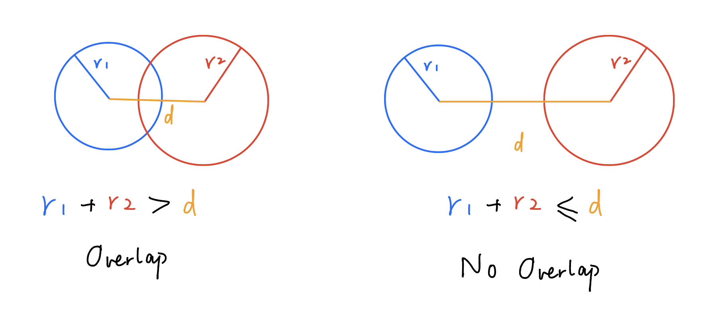

# HW03B Notes

This assignment is about creating non-overlapping circles of different sizes on the canvas. 

It was easy to think of the logic but was a bit hard to implement. My strategy is to first randomly generate a set of "proposals" of circles, then draw each of them on canvas if it doesn't overlap with all the previous circles drawn on the canvas. 

It is easy to check if a circle overlaps with another: let the two circles' radiuses be **r1** and **r2**, and let the distance between their center be **d**. If (**r1** + **r2**) > **d**, then the two circles overlap with each other. Otherwise, the two circles are not overlapped. 

## Plan
Below are some of the tricks I used: 
<ol>
  <li>I packed the x-position, y-position, and radius of a circle in an object type. Therefore, each randomly generated circle proposal can be represented as a "circle" object. </li>
  <li>To store all the qualified circle proposals (the "circle" objects), I created a "circles" array. </li>
  <li>For each of the circles after the first one, check if it overlaps with any of the previous ones. If there is no overlapping detected, push this proposal to the "circles" array. The code checks overlapping by calculating if the sum of two circles' radiuses is less than the distance between their center. </li>
  <li>Lastly, draw all the circles in the "circles" array. </li>
</ol>

## Findings
Upon changing the number of proposals generated, I found that the bigger the number, the more circles are drawn on the canvas. 

I also noted that the number of circles drawn will always be less than or equal to the number of proposals I set. This is because circle proposals are being discarded due to overlapping. If there should be a fixed number of circles drawn on the canvas, the for loop should be replaced by a while loop for the circle proposal checking. 
